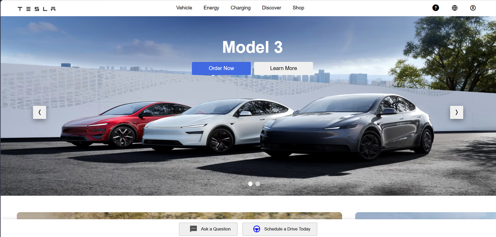
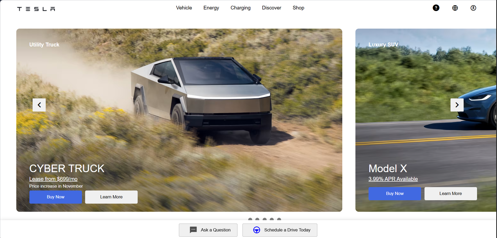
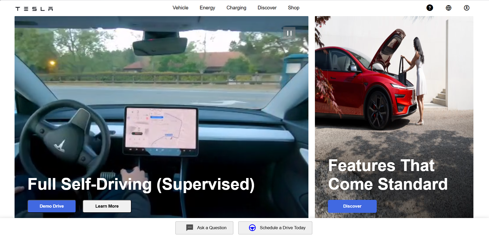
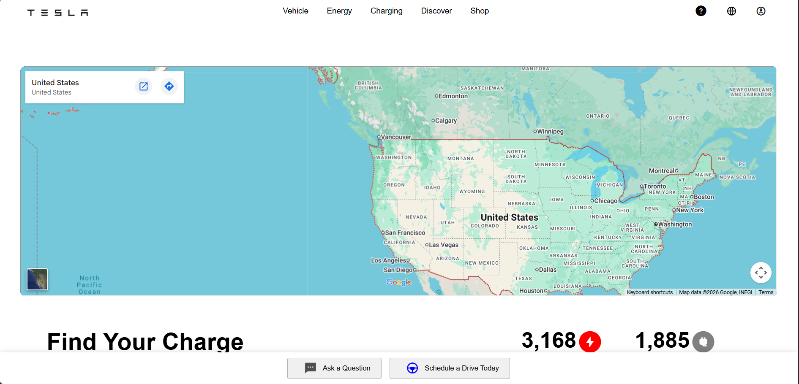

<div align="center">

# ⚡ Tesla Frontend UI Copy

### A pixel-perfect Tesla website clone built with modern frontend technologies.

<p>
  
  
  
  
</p>

</div>

---

## 🚀 Project Overview

This project is a modern recreation of the **Tesla Official Website** built to improve my frontend development skills.

The focus of this project was to create a smooth, responsive, and visually appealing user experience while replicating Tesla's elegant design language.

---

# 📸 Project Preview

## 🏠 Landing Page

<p align="center">

</p>

---

## 🚗 Vehicle Showcase

<p align="center">

</p>

---

## 🔋 Charging Network

<p align="center">

</p>

---

## 🗺 Interactive Map

<p align="center">

</p>

---

# ✨ Features

- 🎨 Tesla-inspired UI
- 📱 Fully Responsive Design
- 🎥 Video Background Support
- 🖼 Image Carousel
- 🚗 Vehicle Showcase
- ⚡ Charging Page
- 🗺 Google Maps Integration
- 🎞 Smooth Animations
- 📌 Sticky Navigation Bar
- 💬 Floating Action Buttons
- 🎯 Clean Component-Based Architecture

---

# 🛠 Tech Stack

| Technology | Usage |
|------------|-------|
| React.js | Frontend Framework |
| JavaScript | Logic |
| HTML5 | Structure |
| CSS Modules | Styling |
| GSAP | Animations |
| Google Maps API | Charging Map |

---

# 📂 Folder Structure

```
Tesla-Frontend-UI-Copy
│
├── public
│
├── src
│   ├── assets
│   ├── components
│   ├── css
│   ├── pages
│   ├── App.jsx
│   └── main.jsx
│
└── package.json
```

---

# 💻 Installation

```bash
git clone https://github.com/Abhinav-Sahoo-04/Tesla-Frontend-UI-Copy.git

cd Tesla-Frontend-UI-Copy

npm install

npm run dev
```

---

# 🎯 Learning Outcomes

Through this project I improved my understanding of:

- Component-based architecture
- Responsive layouts
- CSS Modules
- State Management
- Image optimization
- Animations using GSAP
- Google Maps Integration
- Modern UI Design Principles

---

# 📈 Future Improvements

- Dark Mode
- Authentication
- Tesla API Integration
- Better Mobile Navigation
- Performance Optimization
- Framer Motion Animations

---

# 👨‍💻 Developer

### Abhinav Sahoo

🎓 B.Tech (CSE - Data Science)

💻 Aspiring Full Stack Web Developer

🤖 Interested in Artificial Intelligence & Machine Learning

---

<div align="center">

### ⭐ If you like this project, consider giving it a Star ⭐

</div>
